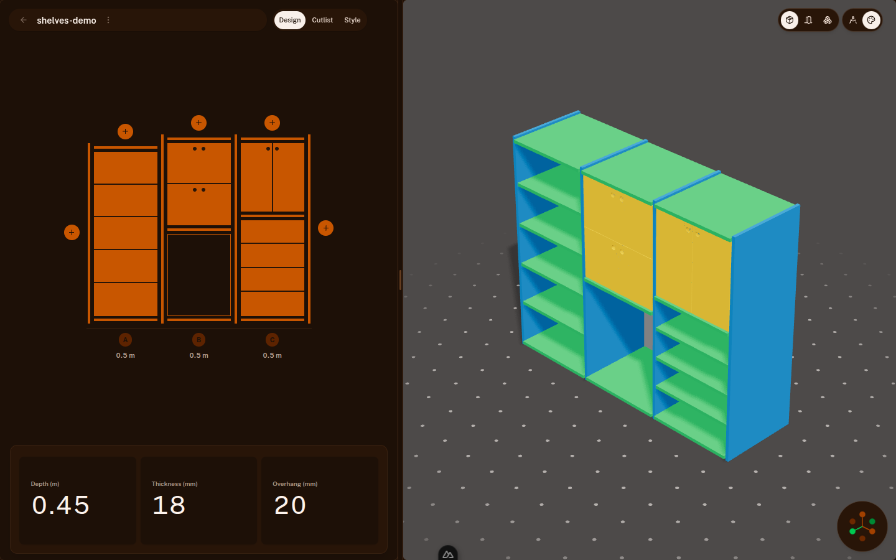
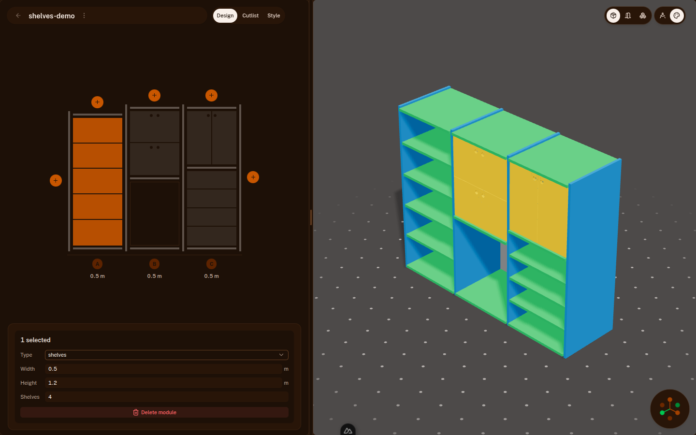
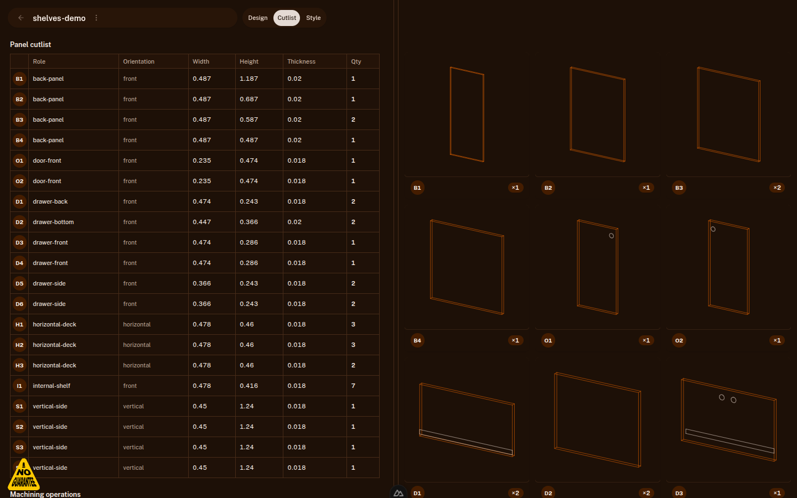
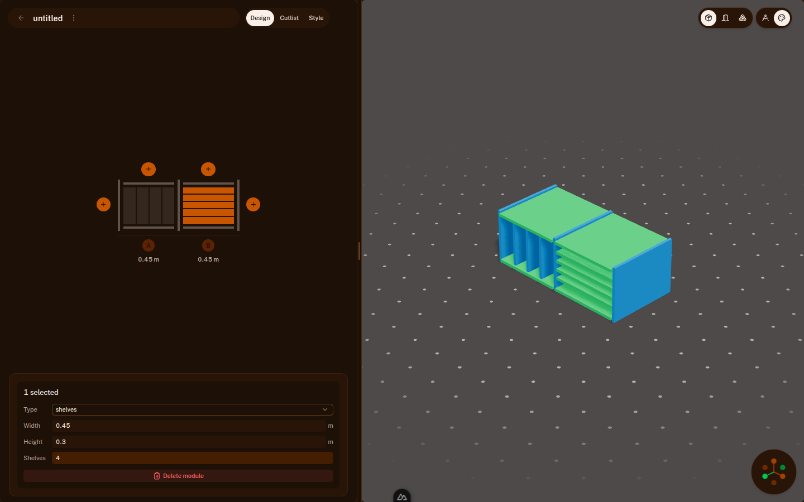

# Porting designs & components from FreeCAD "Woodworking" into Morti

This doc captures how we evaluate and bring capabilities from
[dprojects/Woodworking](https://github.com/dprojects/Woodworking) into Morti, and
gives a **repeatable recipe** for adding a new furniture component. It uses the
`shelves` component (added in this change) as the worked example.

## TL;DR feasibility

- **Woodworking** is a [FreeCAD](https://www.freecad.org/) workbench written in
  Python (~99% Python). It drives FreeCAD's geometry kernel with "magic" macros
  (`magicStart`, `magicDowels`, `magicDriller`, `magicColors`, `getDimensions`,
  `sheet2export`, …).
- **Morti** is a web app (Nuxt 4 / Vue 3 / Three.js) with a **parametric,
  panel-based** model: a design is `columns → modules`, and a compiler turns those
  into panels + operations for 3D, cutlist, and export.

There is **no shared runtime, file format, or geometry kernel**, so we cannot
literally import Woodworking code or `.FCStd` files. What we *can* do — and what
this guide is about — is **replicate the capability as a native Morti component**
that flows through the existing parametric pipeline. That gives us 3D preview,
cutlist, and `.morti` export "for free".

## Capability map: Woodworking → Morti

| Woodworking capability | Morti equivalent | Status |
| --- | --- | --- |
| `magicStart` (furniture skeleton) | `columns → modules` model + designer | Exists |
| Panel furniture parts (sides, shelves, backs) | `PanelRole`s emitted by the compiler | Exists + extended |
| Internal shelves inside a bay | **`shelves` module** | Added |
| Vertical dividers / mullions in a bay | **`dividers` module** | Added |
| `getDimensions` (cut list) | Cutlist view (`shared/domain/cutlist.ts`) | Exists |
| `sheet2export` (CSV/JSON/HTML/MD) | Cutlist export | Partial — formats to add |
| `magicColors` / materials | `PublicStyle` materials + style panel | Exists |
| `magicDowels` / `magicDriller` | `PanelOperation` (`through-hole`, `rail-cut`) | Partial — UI to add |
| Multi-unit (mm/cm/in/board-ft) | metric-only today | To add |

The model below is what makes each new row tractable.

## The data model (what you're mapping onto)

Source of truth: `shared/domain/types.ts`.

```
FurnitureDoc
├─ config: FurnitureConfig          // thicknesses, clearances, depth, limits
└─ columns: FurnitureColumn[]
   ├─ width
   └─ modules: FurnitureModule[]
      ├─ id, type: ModuleType       // shelf | shelves | drawer | doors | left-door | right-door
      ├─ height
      ├─ drawerCount?               // drawer only
      └─ shelfCount?                // shelves only
```

The **compiler** (`shared/domain/assembly.ts › compileAssembly`) walks the columns,
builds a per-module "cell" (the interior box bounded by the surrounding
sides/decks), and dispatches on `module.type` to emit `CompiledPanel`s (each with a
`PanelRole`) plus `PanelOperation`s. Everything downstream keys off `PanelRole`:

- **3D** — `components/three/DesignerCanvas.vue` maps each role to a material part.
- **Cutlist** — `shared/domain/cutlist.ts` groups/labels panels by role.
- **Persistence** — `shared/yjs/doc.ts` (Yjs ⇄ POJO) and `.morti` import/export.

## Worked example: the `shelves` component

`shelves` is an open bay subdivided by N evenly-spaced internal shelf boards —
exactly the kind of part Woodworking builds by hand. It contrasts with the existing
`shelf` module, which is a single empty compartment.



*Column A is a `shelves` module with 4 boards; column C stacks a 3-board `shelves`
module over a `doors` cabinet. The green horizontal boards are the new
`internal-shelf` panels.*



*Selecting the module exposes a new **Shelves** count field, mirroring the existing
**Drawers** field.*



*The cutlist picks up the new role automatically: row **`I1 internal-shelf`**,
Qty 7 (4 + 3 boards), with correct dimensions.*

### Recipe — every layer a new component touches

Follow these in order. Each bullet links the change to the file you edit.

1. **Type model** — `shared/domain/types.ts`
   - Add the value to `ModuleType` (`'shelves'`).
   - Add any per-module field (`shelfCount?: number`).
   - Add a new `PanelRole` if the component emits a new kind of panel
     (`'internal-shelf'`) and give it a `PANEL_ROLE_SHORT_CODE` (`'IS'`).

2. **Defaults & constants** — `shared/domain/defaults.ts`
   - Add the type to `MODULE_TYPES` (this is what the designer's Type dropdown
     iterates).
   - Add `DEFAULT_/MIN_/MAX_` constants (`DEFAULT_SHELF_COUNT`, `SHELF_COUNT_MIN/MAX`).
   - Seed the field in `defaultModule()`.

3. **Compiler** — `shared/domain/assembly.ts`
   - Write a `compile<Component>()` that emits `CompiledPanel`s from the cell
     bounds (`compileShelves` spaces `count` boards across the interior height and
     emits `internal-shelf` panels with `orientation: 'horizontal-xz'`).
   - Dispatch it in `compileModule()`.

4. **Persistence** — `shared/yjs/doc.ts`
   - Accept the new type in `ensureInitialized` (the type allow-list) and in
     `readFurnitureDoc`.
   - Read/write/sanitize the new field in `ensureInitialized`, `readFurnitureDoc`,
     and `toYModule`.
   - Seed defaults in `insertModule` and `setModuleType` (add the field when the
     type is set, delete it when the type changes away).
   - Add a mutator (`setShelfCount`) following `setDrawerCount`.

5. **Cutlist labels** — `shared/domain/cutlist.ts`
   - Add the role to `roleCodes` (`'internal-shelf': 'I'`) so groups get a stable
     prefix.

6. **3D material** — `components/three/DesignerCanvas.vue`
   - Map the new role to a `CabinetPart` in `partForPanel` (internal shelves reuse
     `'deck'`, so no new style config is needed).

7. **Designer UI** — `components/project/ProjectDesigner.vue`
   - Import the constants + mutator.
   - Add a `selected<Field>Value` computed, an `updateSelectedModules<Field>()`,
     and an `onSelected<Field>Commit()` handler (mirror the drawer-count trio).
   - Add the input row in the inspector `<template>`, gated on
     `selectedTypeValue === '<type>'`.

8. **2D front view (optional polish)** — `components/project/ProjectDesignerFrontView.vue`
   - Add a visual branch so the flat designer reflects the part (shelves draw
     evenly-spaced divider lines, like drawer separators).

9. **AI generation (optional)** — `shared/domain/ai-furniture.ts`
   - Add the type to that file's local `MODULE_TYPES`/compact map and normalize the
     new field, so the (off-by-default) AI path can produce it.

> Schema note: adding a module type and an optional field is **backward
> compatible** — old docs still load, so `DESIGN_SCHEMA_VERSION` does not need to
> bump. Only bump it (and add a migration in `shared/yjs/doc.ts › MIGRATIONS`) if
> you rename/remove an existing field.

### Checklist to verify a new component

```bash
npm run typecheck        # whole-pipeline type safety
npm run dev              # then exercise it in the editor
```

Two things to confirm by eye: the part renders in **3D** (assembly view) and shows
up correctly in the **Cutlist** with sane dimensions and quantities.

## Reproducible demo / screenshot workflow

Clicking through the SVG designer is brittle to script, so we seed designs from a
`.morti` fixture instead. `.morti` is a JSON envelope around a base64 Yjs update
(`shared/yjs/morti-format.ts`), so a fixture can be built in plain Node:

```bash
node scripts/make-demo-fixture.mjs docs/assets/woodworking/shelves-demo.morti
```

Edit the `COLUMNS` array in `scripts/make-demo-fixture.mjs` to describe any piece,
then **Import** the file from the Morti home screen (or drive it with Playwright:
`page.locator('input[type=file]').setInputFiles(...)`). The committed
`docs/assets/woodworking/shelves-demo.morti` reproduces the screenshots above.

For headless screenshots in CI/dev containers, Chromium is preinstalled; launch
Playwright with `--use-gl=angle --use-angle=swiftshader` so the Three.js canvas
renders without a GPU.

## Second worked example: the `dividers` component

`dividers` is the vertical counterpart to `shelves` — N evenly-spaced **vertical**
boards (`vertical-divider` role) that split a bay into side-by-side sub-bays. It was
built by following the recipe above verbatim, which is the point: the same nine
edits, swapping "horizontal board across the height" for "vertical board across the
width". Concretely it differs from `shelves` only in:

- the panel `orientation` is `vertical-yz` (not `horizontal-xz`), and boards are
  spaced across the cell **width** (`xMin..xMax`) instead of its height;
- `partForPanel` maps `vertical-divider` to the `sides` material (not `deck`);
- the 2D front-view branch draws vertical lines instead of horizontal ones.

If you're adding a component, copy whichever of the two (`shelves` /  `dividers`)
is closer to your part and adjust those three axis-specific spots.



*Left bay: a `dividers` module (3 vertical boards). Right bay: a `shelves` module
(4 horizontal boards). Both were added live through the editor.*

## What's next (good follow-on ports)

- **Drilling/dowels UI** — surface `PanelOperation` editing (`magicDriller`).
- **Cutlist export formats** — CSV/JSON/HTML/Markdown to match `sheet2export`.
- **Multi-unit display** — a presentation-layer unit toggle (mm/cm/in/board-ft).
